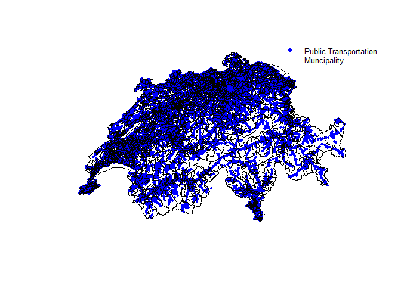
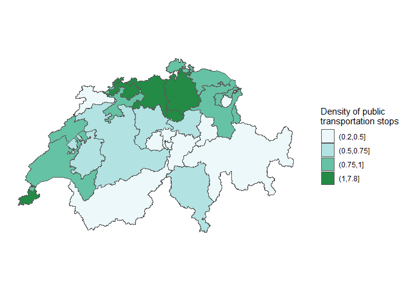
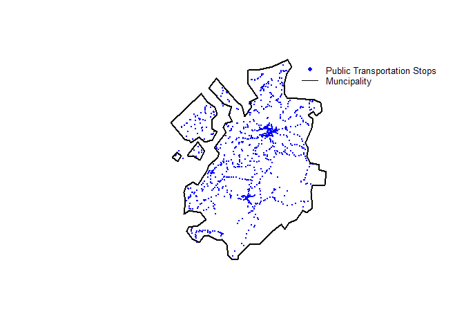
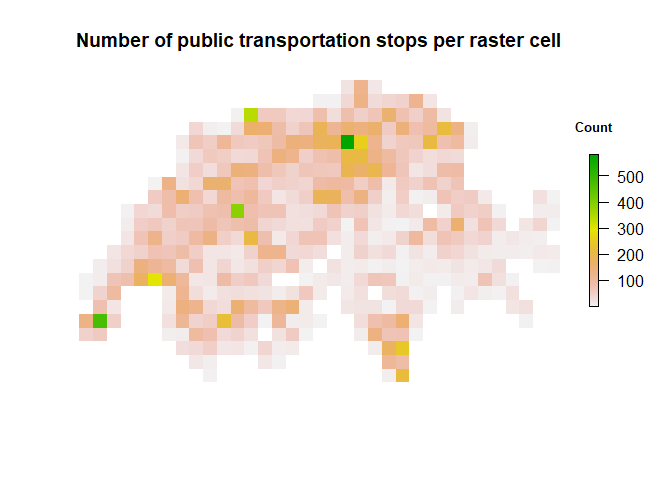
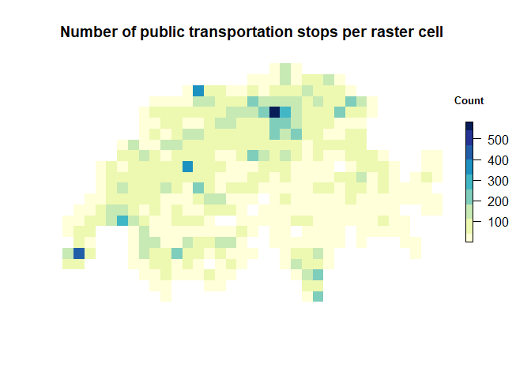
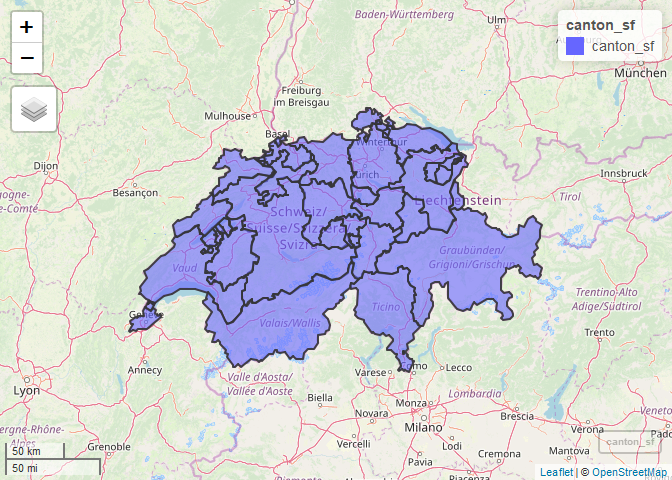

R\_AS\_GIS
----------

Title: “R\_AS\_GIS”
-------------------

### author: “Katharina Kaelin”

### date: “2019”

Die Beispiel wurden vom Statistischen Amt des Kantons Zürich publiziert.

Die Portierung auf die RStudio-Umgebung wurde durch Peter Berger
realisiert. Die ganzem Bereitstellung und Dokumentationsteile wurden aus
Arbeiten von Timo Grossenbacher von SF Data übrnommen und adapiert.

Notes
-----

This report was generated on 2019-09-22 13:42:23. R version: 3.6.1 on
i386-w64-mingw32. For this report, CRAN packages as of 2019-09-21 were
used.

…

### R-Script & data

The preprocessing and analysis of the data was conducted in the [R
project for statistical computing](https://www.r-project.org/). The
RMarkdown script used to generate this document and all the resulting
data can be downloaded [under this
link](http://tgdbepe4.github.io/R_AS_GIS/rscript.zip). Through executing
`main.Rmd`, the herein described process can be reproduced and this
document can be generated. In the course of this, data from the folder
`ìnput` will be processed and results will be written to `output`.

### GitHub

The code for the herein described process can also be freely downloaded
from <https://github.com/tgdbepe4/R_AS_GIS>.

### License

…

### Data description of output files

#### `abc.csv` (Example)

<table>
<thead>
<tr class="header">
<th>Attribute</th>
<th>Type</th>
<th>Description</th>
</tr>
</thead>
<tbody>
<tr class="odd">
<td>a</td>
<td>Numeric</td>
<td>…</td>
</tr>
<tr class="even">
<td>b</td>
<td>Numeric</td>
<td>…</td>
</tr>
<tr class="odd">
<td>c</td>
<td>Numeric</td>
<td>…</td>
</tr>
</tbody>
</table>

### `xyz.csv`

…

Preparations
------------

    ## Loading required package: knitr

    ## Loading required package: rstudioapi

    ## [1] "package package:rstudioapi detached"

    ## Warning: 'knitr' namespace cannot be unloaded:
    ##   namespace 'knitr' is imported by 'rmarkdown' so cannot be unloaded

    ## [1] "package package:knitr detached"

### Define packages

    # from https://mran.revolutionanalytics.com/web/packages/checkpoint/vignettes/using-checkpoint-with-knitr.html
    # if you don't need a package, remove it from here (commenting is probably not sufficient)
    # tidyverse: see https://blog.rstudio.org/2016/09/15/tidyverse-1-0-0/
    cat("
    library(rstudioapi)
    library(tidyverse) # ggplot2, dplyr, tidyr, readr, purrr, tibble
    library(magrittr) # pipes
    library(readxl) # excel
    library(scales) # scales for ggplot2
    library(jsonlite) # json
    library(lintr) # code linting
    library(sf) # spatial data handling
    library(rmarkdown) # Import libraries
    library(tidyverse) # collection of R packages designed for data science
    # Vector
    library(sf) ## GIS vector library new
    library(sp) ## GIS vector library old
    # Raster
    library(raster) ## GIS raster library 
    # Visualization
    library(RColorBrewer) ## ready-to-use color palettes for creating beautiful graphics
    library(rmapshaper) ## used to simplify geometries
    library(tmap) ## easy to use approach to to create theamtic maps
    library(mapview) ## interactive visualisations of spatial data
    library(classInt) ## methods for choosing univariate class intervals for mapping or other graphics purposes",
    file = "manifest.R")

### Install packages

    # if checkpoint is not yet installed, install it (for people using this
    # system for the first time)
    if (!require(checkpoint)) {
      if (!require(devtools)) {
        install.packages("devtools", repos = "http://cran.us.r-project.org")
        require(devtools)
      }
      devtools::install_github("RevolutionAnalytics/checkpoint",
                               ref = "v0.3.2", # could be adapted later,
                               # as of now (beginning of July 2017
                               # this is the current release on CRAN)
                               repos = "http://cran.us.r-project.org")
      require(checkpoint)
    }
    # nolint start
    if (!dir.exists("~/.checkpoint")) {
      dir.create("~/.checkpoint")
    }
    # nolint end
    # install packages for the specified CRAN snapshot date
    checkpoint(snapshotDate = package_date,
               project = path_to_wd,
               verbose = T,
               scanForPackages = T,
               use.knitr = F,
               R.version = R_version)
    rm(package_date)

### Load packages

    source("manifest.R")
    unlink("manifest.R")
    sessionInfo()

    ## R version 3.6.1 (2019-07-05)
    ## Platform: i386-w64-mingw32/i386 (32-bit)
    ## Running under: Windows 10 x64 (build 18362)
    ## 
    ## Matrix products: default
    ## 
    ## locale:
    ## [1] LC_COLLATE=German_Switzerland.1252  LC_CTYPE=German_Switzerland.1252   
    ## [3] LC_MONETARY=German_Switzerland.1252 LC_NUMERIC=C                       
    ## [5] LC_TIME=German_Switzerland.1252    
    ## 
    ## attached base packages:
    ## [1] stats     graphics  grDevices utils     datasets  methods   base     
    ## 
    ## other attached packages:
    ##  [1] classInt_0.4-1     mapview_2.7.0      tmap_2.3-1        
    ##  [4] rmapshaper_0.4.1   RColorBrewer_1.1-2 raster_3.0-2      
    ##  [7] sp_1.3-1           rmarkdown_1.15     sf_0.7-7          
    ## [10] lintr_1.0.3        jsonlite_1.6       scales_1.0.0      
    ## [13] readxl_1.3.1       magrittr_1.5       forcats_0.4.0     
    ## [16] stringr_1.4.0      dplyr_0.8.3        purrr_0.3.2       
    ## [19] readr_1.3.1        tidyr_1.0.0        tibble_2.1.3      
    ## [22] ggplot2_3.2.1      tidyverse_1.2.1    rstudioapi_0.10   
    ## [25] checkpoint_0.4.7  
    ## 
    ## loaded via a namespace (and not attached):
    ##  [1] Rcpp_1.0.1         knitr_1.23         xml2_1.2.2        
    ##  [4] units_0.6-4        hms_0.5.1          rvest_0.3.4       
    ##  [7] tidyselect_0.2.5   viridisLite_0.3.0  xtable_1.8-4      
    ## [10] jsonvalidate_1.1.0 colorspace_1.4-1   lattice_0.20-38   
    ## [13] R6_2.4.0           rlang_0.4.0        rgdal_1.4-4       
    ## [16] broom_0.5.2        xfun_0.8           e1071_1.7-2       
    ## [19] modelr_0.1.5       withr_2.1.2        rgeos_0.5-1       
    ## [22] leafsync_0.1.0     htmltools_0.3.6    class_7.3-15      
    ## [25] leaflet_2.0.2      assertthat_0.2.1   digest_0.6.19     
    ## [28] httpcode_0.2.0     lifecycle_0.1.0    shiny_1.3.2       
    ## [31] crul_0.8.4         curl_4.0           haven_2.1.1       
    ## [34] compiler_3.6.1     cellranger_1.1.0   pillar_1.4.2      
    ## [37] backports_1.1.4    generics_0.0.2     stats4_3.6.1      
    ## [40] geojsonlint_0.3.0  satellite_1.0.1    lubridate_1.7.4   
    ## [43] httpuv_1.5.2       pkgconfig_2.0.2    rex_1.1.2         
    ## [46] munsell_0.5.0      httr_1.4.1         tools_3.6.1       
    ## [49] webshot_0.5.1      dichromat_2.0-0    grid_3.6.1        
    ## [52] nlme_3.1-140       gtable_0.3.0       png_0.1-7         
    ## [55] KernSmooth_2.23-15 DBI_1.0.0          cli_1.1.0         
    ## [58] crosstalk_1.0.0    lazyeval_0.2.2     yaml_2.2.0        
    ## [61] lwgeom_0.1-7       crayon_1.3.4       later_0.8.0       
    ## [64] base64enc_0.1-3    tmaptools_2.0-2    htmlwidgets_1.3   
    ## [67] promises_1.0.1     codetools_0.2-16   vctrs_0.2.0       
    ## [70] zeallot_0.1.0      mime_0.7           glue_1.3.1        
    ## [73] evaluate_0.14      V8_2.3             stringi_1.4.3     
    ## [76] XML_3.98-1.20

### Load additional scripts

    # if you want to outsource logic to other script files, see README for 
    # further information
    knitr::read_chunk("scripts/my_script.R")
    source("scripts/my_script.R")
    my_function(5)

    ## [1] 5

\#\#Import data \#\#Public transportation stops The public
transportation stops dataset was downloded here:
<a href="https://data.geo.admin.ch/ch.bav.haltestellen-oev/data.zip" class="uri">https://data.geo.admin.ch/ch.bav.haltestellen-oev/data.zip</a>
Release date: 06-08-2018 Format: csv

    # Import csv as df
    pts_df <- read.csv("./Data_in/Betriebspunkt.csv", stringsAsFactors=FALSE, header= TRUE) 

    # Select desired attributes
    pts_df <- pts_df %>%
      dplyr::select(pts_ID = "Nummer", pts_MunNr = "GdeNummer", "y_Koord_Ost", "x_Koord_Nord") 
    # !! Thre is a small mistake in this dataset: The X and Y values are swapped. Correctly, the attributes should be named as follows: x_Koord_Ost, y_Koord_Nord. 

    # Convert df to spatial df
    pts_sf <- sf::st_as_sf(x = pts_df, coords = c("y_Koord_Ost", "x_Koord_Nord"), crs= 2056) # epsg:2056 is the ID of LV95

    # Check data
    class(pts_df)

    ## [1] "data.frame"

    ## [1] "data.frame"
    pts_df[1:5,]

    ##    pts_ID pts_MunNr y_Koord_Ost x_Koord_Nord
    ## 1 8508186       338     2628463      1220751
    ## 2 8587698      6173     2643683      1132003
    ## 3 8531188      6252     2613318      1109828
    ## 4 8530051      5409     2572770      1129980
    ## 5 8501442      6057     2650331      1141959

    ##    pts_ID pts_MunNr y_Koord_Ost x_Koord_Nord
    ## 1 8508186       338     2628463      1220751
    ## 2 8587698      6173     2643683      1132003
    ## 3 8531188      6252     2613318      1109828
    ## 4 8530051      5409     2572770      1129980
    ## 5 8501442      6057     2650331      1141959

    class(pts_sf)

    ## [1] "sf"         "data.frame"

    ## [1] "sf"         "data.frame"
    pts_sf[1:5,]

    ## Simple feature collection with 5 features and 2 fields
    ## geometry type:  POINT
    ## dimension:      XY
    ## bbox:           xmin: 2572770 ymin: 1109828 xmax: 2650331 ymax: 1220751
    ## epsg (SRID):    2056
    ## proj4string:    +proj=somerc +lat_0=46.95240555555556 +lon_0=7.439583333333333 +k_0=1 +x_0=2600000 +y_0=1200000 +ellps=bessel +towgs84=674.374,15.056,405.346,0,0,0,0 +units=m +no_defs
    ##    pts_ID pts_MunNr                geometry
    ## 1 8508186       338 POINT (2628463 1220751)
    ## 2 8587698      6173 POINT (2643683 1132003)
    ## 3 8531188      6252 POINT (2613318 1109828)
    ## 4 8530051      5409 POINT (2572770 1129980)
    ## 5 8501442      6057 POINT (2650331 1141959)

    ## Simple feature collection with 5 features and 2 fields
    ## geometry type:  POINT
    ## dimension:      XY
    ## bbox:           xmin: 2572770 ymin: 1109830 xmax: 2650330 ymax: 1220750
    ## epsg (SRID):    2056
    ## proj4string:    +proj=somerc +lat_0=46.95240555555556 +lon_0=7.439583333333333 +k_0=1 +x_0=2600000 +y_0=1200000 +ellps=bessel +towgs84=674.374,15.056,405.346,0,0,0,0 +units=m +no_defs
    ##    pts_ID pts_MunNr                geometry
    ## 1 8508186       338 POINT (2628463 1220751)
    ## 2 8587698      6173 POINT (2643683 1132003)
    ## 3 8531188      6252 POINT (2613318 1109828)
    ## 4 8530051      5409 POINT (2572770 1129980)
    ## 5 8501442      6057 POINT (2650331 1141959)

\#\#Municipality The municipality dataset was downloded here:
<a href="https://shop.swisstopo.admin.ch/de/products/landscape/boundaries3D" class="uri">https://shop.swisstopo.admin.ch/de/products/landscape/boundaries3D</a>
Release date: 2019 Format: Shapefile

    # Import shp as spatial df
    mun_sf <- sf::st_read("./Data_in/swissBOUNDARIES3D_1_3_TLM_HOHEITSGEBIET.shp", stringsAsFactors = FALSE, crs=2056)

    ## Reading layer `swissBOUNDARIES3D_1_3_TLM_HOHEITSGEBIET' from data source `E:\R_github\R_AS_GIS\analysis\Data_in\swissBOUNDARIES3D_1_3_TLM_HOHEITSGEBIET.shp' using driver `ESRI Shapefile'
    ## Simple feature collection with 2361 features and 23 fields
    ## geometry type:  POLYGON
    ## dimension:      XYZ
    ## bbox:           xmin: 2485410 ymin: 1075268 xmax: 2833858 ymax: 1295934
    ## epsg (SRID):    2056
    ## proj4string:    +proj=somerc +lat_0=46.95240555555556 +lon_0=7.439583333333333 +k_0=1 +x_0=2600000 +y_0=1200000 +ellps=bessel +towgs84=674.374,15.056,405.346,0,0,0,0 +units=m +no_defs

    ## Reading layer `swissBOUNDARIES3D_1_3_TLM_HOHEITSGEBIET' from data source `C:\gitrepos\R_AS_GIS\Data_in\swissBOUNDARIES3D_1_3_TLM_HOHEITSGEBIET.shp' using driver `ESRI Shapefile'
    ## Simple feature collection with 2361 features and 23 fields
    ## geometry type:  POLYGON
    ## dimension:      XYZ
    ## bbox:           xmin: 2485410 ymin: 1075270 xmax: 2833860 ymax: 1295930
    ## epsg (SRID):    2056
    ## proj4string:    +proj=somerc +lat_0=46.95240555555556 +lon_0=7.439583333333333 +k_0=1 +x_0=2600000 +y_0=1200000 +ellps=bessel +towgs84=674.374,15.056,405.346,0,0,0,0 +units=m +no_defs

    # Select desired attributes
    mun_sf <- mun_sf %>%
      dplyr::select(mun_MunNr = "BFS_NUMMER", mun_CanNr = "KANTONSNUM") %>%
      dplyr::group_by(mun_MunNr)%>%
      dplyr::summarize(
        mun_CanNr = unique(mun_CanNr)
        ) %>%
      st_zm(drop =  TRUE)

    # Check data
    class(mun_sf)

    ## [1] "sf"         "tbl_df"     "tbl"        "data.frame"

    ## [1] "sf"         "tbl_df"     "tbl"        "data.frame"
    mun_sf[1:5,]

    ## Simple feature collection with 5 features and 2 fields
    ## geometry type:  POLYGON
    ## dimension:      XY
    ## bbox:           xmin: 2673826 ymin: 1230185 xmax: 2686463 ymax: 1243159
    ## epsg (SRID):    2056
    ## proj4string:    +proj=somerc +lat_0=46.95240555555556 +lon_0=7.439583333333333 +k_0=1 +x_0=2600000 +y_0=1200000 +ellps=bessel +towgs84=674.374,15.056,405.346,0,0,0,0 +units=m +no_defs
    ## # A tibble: 5 x 3
    ##   mun_MunNr mun_CanNr                                              geometry
    ##       <int>     <int>                                         <POLYGON [m]>
    ## 1         1         1 ((2680492 1235035, 2680482 1235041, 2680473 1235046,~
    ## 2         2         1 ((2674714 1236942, 2674699 1237008, 2674689 1237061,~
    ## 3         3         1 ((2679008 1241960, 2679015 1241965, 2679022 1241971,~
    ## 4         4         1 ((2686028 1230192, 2686026 1230195, 2686024 1230205,~
    ## 5         5         1 ((2678523 1238540, 2678511 1238544, 2678431 1238561,~

    ## Simple feature collection with 5 features and 2 fields
    ## geometry type:  POLYGON
    ## dimension:      XY
    ## bbox:           xmin: 2673830 ymin: 1230190 xmax: 2686460 ymax: 1243160
    ## epsg (SRID):    2056
    ## proj4string:    +proj=somerc +lat_0=46.95240555555556 +lon_0=7.439583333333333 +k_0=1 +x_0=2600000 +y_0=1200000 +ellps=bessel +towgs84=674.374,15.056,405.346,0,0,0,0 +units=m +no_defs
    ## # A tibble: 5 x 3
    ##   mun_MunNr mun_CanNr                                              geometry
    ##       <int>     <int>                                         <POLYGON [m]>
    ## 1         1         1 ((2680492 1235035, 2680482 1235041, 2680473 1235046,~
    ## 2         2         1 ((2674714 1236942, 2674699 1237008, 2674689 1237061,~
    ## 3         3         1 ((2679008 1241960, 2679015 1241965, 2679022 1241971,~
    ## 4         4         1 ((2686028 1230192, 2686026 1230195, 2686024 1230205,~
    ## 5         5         1 ((2678523 1238540, 2678511 1238544, 2678431 1238561,~

    # Plot imported data: R base plot
    plot(st_geometry(pts_sf), pch = 19, col="blue", cex = 0.5)
    plot(st_geometry(mun_sf), add = TRUE)
    legend(x=2750000,y=1310000,
           c("Public Transportation Stops","Muncipality"),
           lty=c(NA,1),
           pch=c(19,NA),
           cex=.8, 
           col=c("blue","black"),
           bty='n'
           )

\#\#Calculate density of public transportation stops per municipality

    # Spatial Join: instead of joining dataframes via an equal ID we join data- frames based on an equal location. 
    spjoin_sf <- sf::st_join(pts_sf, mun_sf)

    spjoin_sf

    ## Simple feature collection with 26895 features and 4 fields
    ## geometry type:  POINT
    ## dimension:      XY
    ## bbox:           xmin: 2486195 ymin: 1075525 xmax: 2831996 ymax: 1294167
    ## epsg (SRID):    2056
    ## proj4string:    +proj=somerc +lat_0=46.95240555555556 +lon_0=7.439583333333333 +k_0=1 +x_0=2600000 +y_0=1200000 +ellps=bessel +towgs84=674.374,15.056,405.346,0,0,0,0 +units=m +no_defs
    ## First 10 features:
    ##     pts_ID pts_MunNr mun_MunNr mun_CanNr                geometry
    ## 1  8508186       338       338         2 POINT (2628463 1220751)
    ## 2  8587698      6173      6173        23 POINT (2643683 1132003)
    ## 3  8531188      6252      6252        23 POINT (2613318 1109828)
    ## 4  8530051      5409      5409        22 POINT (2572770 1129980)
    ## 5  8501442      6057      6057        23 POINT (2650331 1141959)
    ## 6  8583656      6702      6702        26 POINT (2584548 1246665)
    ## 7  8590028       351       351         2 POINT (2599934 1200621)
    ## 8  8579143      5871      5871        22 POINT (2509845 1163460)
    ## 9  8572195      2788      2788        13 POINT (2599991 1249781)
    ## 10 8576536       576       576         2 POINT (2643212 1163308)

    ## Simple feature collection with 26895 features and 4 fields
    ## geometry type:  POINT
    ## dimension:      XY
    ## bbox:           xmin: 2486200 ymin: 1075520 xmax: 2832000 ymax: 1294170
    ## epsg (SRID):    2056
    ## proj4string:    +proj=somerc +lat_0=46.95240555555556 +lon_0=7.439583333333333 +k_0=1 +x_0=2600000 +y_0=1200000 +ellps=bessel +towgs84=674.374,15.056,405.346,0,0,0,0 +units=m +no_defs
    ## First 10 features:
    ##     pts_ID pts_MunNr mun_MunNr mun_CanNr                geometry
    ## 1  8508186       338       338         2 POINT (2628463 1220751)
    ## 2  8587698      6173      6173        23 POINT (2643683 1132003)
    ## 3  8531188      6252      6252        23 POINT (2613318 1109828)
    ## 4  8530051      5409      5409        22 POINT (2572770 1129980)
    ## 5  8501442      6057      6057        23 POINT (2650331 1141959)
    ## 6  8583656      6702      6702        26 POINT (2584548 1246665)
    ## 7  8590028       351       351         2 POINT (2599934 1200621)
    ## 8  8579143      5871      5871        22 POINT (2509845 1163460)
    ## 9  8572195      2788      2788        13 POINT (2599991 1249781)
    ## 10 8576536       576       576         2 POINT (2643212 1163308)

    # Check: Did the Federal Office of Transport use the same municiaplity boundaries as we did in order to add the municipality inforamtion to the dataset (pts_sf$pts_MunNr)?
    spjoin_sf_check <-  spjoin_sf %>%
      dplyr::select(mun_MunNr,pts_MunNr) %>%
      dplyr::mutate (check = (spjoin_sf$mun_MunNr == spjoin_sf$pts_MunNr)) %>%
      dplyr::arrange(check)

    table(spjoin_sf_check$check) #462/26408*100 = 1.75%

    ## 
    ## FALSE  TRUE 
    ##   475 26395

    ## 
    ## FALSE  TRUE 
    ##   475 26395
    # ... no, they did not. Probably they used the same dataset with a different reference date.   

    # Density calculation

    # > 1. Count points per polygon
    pts_count <- spjoin_sf %>%
       dplyr::group_by(mun_MunNr) %>%
       dplyr::summarise(count=n())

    mun_sf <- mun_sf %>%
      dplyr::left_join(pts_count %>% st_set_geometry(NULL) , by = c("mun_MunNr" ))

    # > 2. Calculate area of polygon
    mun_sf <- mun_sf %>%
      dplyr::mutate(mun_area_m2 =as.vector(sf::st_area(.)))

    # > 3. Calculate density: count/area
    mun_sf$density <- mun_sf$count / mun_sf$mun_area_m2 * 1000000

    # Plot result: tmap
    # > tmap static
    tmap::tmap_mode("plot")
    #tmap_mode("view")
    tmap::tm_shape(mun_sf) +
      tmap::tm_fill("density",
              title="Density of public transportation stops",
              style="quantile", 
              palette="BuGn", 
              colorNA = "blue")  +
      tmap::tm_layout(frame = FALSE)

\#\#Calculate density of public transportation stops per canton

    # group_by mun_CanNr
    canton_sf <- mun_sf %>%
      dplyr::select(mun_CanNr,  count, mun_area_m2) %>%
      dplyr::group_by(mun_CanNr)%>%
      dplyr::summarize(
        count = sum(count, na.rm = TRUE),
        mun_area_m2 = sum(mun_area_m2,  na.rm = TRUE)
        )  %>%
      dplyr::mutate(
        density = round((count/mun_area_m2 * 1000000),1)
        )

    # Plot result: ggplot
    # Get quantile breaks. Add .00001 offset to catch the lowest value
    breaks_qt <- classInt::classIntervals(c(min(canton_sf$density) - .00001, canton_sf$density), n = 4, style = "quantile")
    breaks_qt$brks

    ## [1] 0.19999 0.50000 0.75000 1.00000 7.80000

    ## [1] 0.19999 0.50000 0.75000 1.00000 7.80000

    # Use cut to divice density into intervals and code them according to which interval they are in.
    canton_sf <- canton_sf %>%
       dplyr::mutate(mycat = cut(density, breaks_qt$brks)) %>%
       dplyr::arrange(density)
    canton_sf$mycat

    ##  [1] (0.2,0.5]  (0.2,0.5]  (0.2,0.5]  (0.2,0.5]  (0.2,0.5]  (0.2,0.5] 
    ##  [7] (0.2,0.5]  (0.2,0.5]  (0.5,0.75] (0.5,0.75] (0.5,0.75] (0.5,0.75]
    ## [13] (0.5,0.75] (0.75,1]   (0.75,1]   (0.75,1]   (0.75,1]   (0.75,1]  
    ## [19] (0.75,1]   (0.75,1]   (0.75,1]   (1,7.8]    (1,7.8]    (1,7.8]   
    ## [25] (1,7.8]    (1,7.8]    (1,7.8]   
    ## Levels: (0.2,0.5] (0.5,0.75] (0.75,1] (1,7.8]

    ##  [1] (0.2,0.5]  (0.2,0.5]  (0.2,0.5]  (0.2,0.5]  (0.2,0.5]  (0.2,0.5] 
    ##  [7] (0.2,0.5]  (0.2,0.5]  (0.5,0.75] (0.5,0.75] (0.5,0.75] (0.5,0.75]
    ## [13] (0.5,0.75] (0.75,1]   (0.75,1]   (0.75,1]   (0.75,1]   (0.75,1]  
    ## [19] (0.75,1]   (0.75,1]   (0.75,1]   (1,7.8]    (1,7.8]    (1,7.8]   
    ## [25] (1,7.8]    (1,7.8]    (1,7.8]   
    ## Levels: (0.2,0.5] (0.5,0.75] (0.75,1] (1,7.8]

    ggplot2::ggplot(canton_sf) + 
        geom_sf(aes(fill=mycat)) +
        scale_fill_brewer(palette = "BuGn", name = "Density of public\ntransportation stops")  + 
        coord_sf(datum=NA) + # no coordinate grid
        theme_bw() +# background = white
        theme(
          panel.border = element_blank() # no border line around plot
          )

\#\#Filter by canton: Freiburg

    # Filter mun_CanNr == 10 
    pts_freiburg<- spjoin_sf %>%
        dplyr::filter(mun_CanNr == 10)

    canton_freiburg <- canton_sf %>%
      dplyr::filter(mun_CanNr == 10)

    # Plot result: R base plot
    plot(st_geometry(pts_freiburg), pch = 19, col="blue", cex = 0.1)
    plot(st_geometry(canton_freiburg), lwd = 2, add = TRUE)
    legend(x=2587000 ,y=1206350,
           c("Public Transportation Stops","Muncipality"),
           lty=c(NA,1),
           pch=c(19,NA),
           cex=.8, 
           col=c("blue","black"),
           bty='n'
           )

    # This plot contains a lot of data as it contains a lot of coordinates. Do we really need this level of detail for our visualization? Often we don't. 

    # Reduce level of detail
    canton_freiburg_gen <- rmapshaper::ms_simplify(canton_freiburg, keep = 0.01, keep_shapes = TRUE)
    plot(st_geometry(pts_freiburg), pch = 19, col="blue", cex = 0.1)
    plot(st_geometry(canton_freiburg_gen), lwd = 2, add = TRUE)
    legend(x=2587000 ,y=1206350,
           c("Public Transportation Stops","Muncipality"),
           lty=c(NA,1),
           pch=c(19,NA),
           cex=.8, 
           col=c("blue","black"),
           bty='n'
           )

\#\#Calculate number of public transportation stops per raster cells

    # We will use the sp package to carry out this analysis because point pattern analysis is still more established for this package. 

    # sf to sp
    pts_sp <- as(pts_sf, Class = "Spatial")

    # Create grid with raster cell size 10'000 x 10'000m
    boundingbox_pts_sp = as(extent(pts_sp), "SpatialPolygons")
    r = raster::raster(boundingbox_pts_sp, resolution = 10000)
    crs(r) <- CRS('+init=EPSG:2056')

    # Count points per raster cell 
    rc = raster::rasterize(pts_sp@coords, r, fun = "count")

    rc

    ## class      : RasterLayer 
    ## dimensions : 22, 35, 770  (nrow, ncol, ncell)
    ## resolution : 10000, 10000  (x, y)
    ## extent     : 2486195, 2836195, 1074167, 1294167  (xmin, xmax, ymin, ymax)
    ## crs        : +init=EPSG:2056 +proj=somerc +lat_0=46.95240555555556 +lon_0=7.439583333333333 +k_0=1 +x_0=2600000 +y_0=1200000 +ellps=bessel +towgs84=674.374,15.056,405.346,0,0,0,0 +units=m +no_defs 
    ## source     : memory
    ## names      : layer 
    ## values     : 1, 582  (min, max)

    ## class       : RasterLayer 
    ## dimensions  : 22, 35, 770  (nrow, ncol, ncell)
    ## resolution  : 10000, 10000  (x, y)
    ## extent      : 2486195, 2836195, 1074167, 1294167  (xmin, xmax, ymin, ymax)
    ## coord. ref. : +init=EPSG:2056 +proj=somerc +lat_0=46.95240555555556 +lon_0=7.439583333333333 +k_0=1 +x_0=2600000 +y_0=1200000 +ellps=bessel +towgs84=674.374,15.056,405.346,0,0,0,0 +units=m +no_defs 
    ## data source : in memory
    ## names       : layer 
    ## values      : 1, 582  (min, max)

    # Plot result: raster plot
    raster::plot(rc, 
         bty="n", 
         box=FALSE, 
         xaxt = "n", 
         yaxt = "n", 
         legend.args = list(text = 'Count', cex = 0.8, line = 1, font = 2),
          main="Number of public transportation stops per raster cell")

    # As many as 8 percent of men and 0.5 percent of women with Northern European ancestry have the common form of red-green color blindness. Thus,  red and green colours should not be used together (http://east.nei.nih.gov:443/learn-about-eye-health/eye-conditions-and-diseases/color-blindness)

    my.palette = RColorBrewer::brewer.pal(n = 9, name = "YlGnBu")
    raster::plot(rc, 
                 col = my.palette, 
                 bty="n", 
                 box=FALSE,  
                 xaxt = "n", yaxt = "n", 
                 legend.args = list(text = 'Count', cex = 0.8, line = 1, font = 2), 
                 main="Number of public transportation stops per raster cell")

\#\#Count number of public transportation stops in a defined area

    # Somdbody asked us to calculate the number of public transportation stops 500m around this coordinate: 
    N <- 47.37861
    E <- 8.53768

    # Create df
    mypoint_df <-  data.frame(N,E)

    # Convert df to spatial df
    mypoint_sf <- sf::st_as_sf(x = mypoint_df, coords = c("E", "N"), crs= 4326) %>%  #epsg:4326 is the ID of WGS84
      sf::st_transform(2056)

    # Calculate area 500 m around mypoint_sf
    myarea_sf <- mypoint_sf %>%
      sf::st_buffer(500) %>%
      dplyr::mutate(name = "MyArea")

    # Count points per myarea_sf
    spjoin_sf <- st_join(pts_sf, myarea_sf)

    pts_count  <- spjoin_sf %>% 
      dplyr::group_by(name) %>%
      dplyr::summarise(count=n())

    pts_count

    ## Simple feature collection with 2 features and 2 fields
    ## geometry type:  MULTIPOINT
    ## dimension:      XY
    ## bbox:           xmin: 2486195 ymin: 1075525 xmax: 2831996 ymax: 1294167
    ## epsg (SRID):    2056
    ## proj4string:    +proj=somerc +lat_0=46.95240555555556 +lon_0=7.439583333333333 +k_0=1 +x_0=2600000 +y_0=1200000 +ellps=bessel +towgs84=674.374,15.056,405.346,0,0,0,0 +units=m +no_defs
    ## # A tibble: 2 x 3
    ##   name   count                                                     geometry
    ## * <chr>  <int>                                             <MULTIPOINT [m]>
    ## 1 MyArea    20 (2682739 1247828, 2682785 1248499, 2682843 1247879, 2682890~
    ## 2 <NA>   26875 (2486195 1111396, 2486530 1112028, 2486730 1111962, 2486957~

    ## Simple feature collection with 2 features and 2 fields
    ## geometry type:  MULTIPOINT
    ## dimension:      XY
    ## bbox:           xmin: 2486200 ymin: 1075520 xmax: 2832000 ymax: 1294170
    ## epsg (SRID):    2056
    ## proj4string:    +proj=somerc +lat_0=46.95240555555556 +lon_0=7.439583333333333 +k_0=1 +x_0=2600000 +y_0=1200000 +ellps=bessel +towgs84=674.374,15.056,405.346,0,0,0,0 +units=m +no_defs
    ## # A tibble: 2 x 3
    ##   name   count                                                     geometry
    ## * <chr>  <int>                                             <MULTIPOINT [m]>
    ## 1 MyArea    20 (2682739 1247828, 2682785 1248499, 2682843 1247879, 2682890~
    ## 2 <NA>   26875 (2486195 1111396, 2486530 1112028, 2486730 1111962, 2486957~

    # Plot result: R base plot
    plot(st_geometry(myarea_sf, col="grey",border="black"))
    plot(st_geometry(mypoint_sf), pch = 19, col="blue", cex =1, add = TRUE)
    plot(st_geometry(pts_sf), pch = 19, col="red", cex =0.5, add = TRUE)

\#\#Export Data

    # shp
    sf::st_write(canton_freiburg_gen, "./Data_out/canton_freiburg_gen.shp", delete_layer = TRUE)

    ## Deleting layer `canton_freiburg_gen' using driver `ESRI Shapefile'
    ## Writing layer `canton_freiburg_gen' to data source `./Data_out/canton_freiburg_gen.shp' using driver `ESRI Shapefile'
    ## features:       1
    ## fields:         5
    ## geometry type:  Multi Polygon

    ## Deleting layer `canton_freiburg_gen' using driver `ESRI Shapefile'
    ## Writing layer `canton_freiburg_gen' to data source `./Data_out/canton_freiburg_gen.shp' using driver `ESRI Shapefile'
    ## features:       1
    ## fields:         5
    ## geometry type:  Multi Polygon

    # json
    path_4326 = "./Data_out/mun_join_pt_sf_freiburg_gen.json"
    file.remove(path_4326)

    ## [1] TRUE

    ## [1] TRUE
    sf::st_write(canton_freiburg_gen %>% st_transform(4326), path_4326, driver="GeoJSON")

    ## Writing layer `mun_join_pt_sf_freiburg_gen' to data source `./Data_out/mun_join_pt_sf_freiburg_gen.json' using driver `GeoJSON'
    ## features:       1
    ## fields:         5
    ## geometry type:  Multi Polygon

    ## Writing layer `mun_join_pt_sf_freiburg_gen' to data source `./Data_out/mun_join_pt_sf_freiburg_gen.json' using driver `GeoJSON'
    ## features:       1
    ## fields:         5
    ## geometry type:  Multi Polygon

    # tif
    raster::writeRaster(rc, filename= "./Data_out/rc.tif", format="GTiff", overwrite=TRUE)

\#\#Which canton has the longest border?

    # Calculate line length
    canton_line_sf <- canton_sf %>%
       sf::st_cast("MULTILINESTRING") %>%
       dplyr::mutate(length_km = round(as.vector(as.vector(sf::st_length(.)))/1000,digits = 0))

    canton_sf <-canton_sf %>%
     dplyr::mutate(
     length_km =   canton_line_sf$length_km
      ) %>%
     dplyr::arrange(desc(length_km))

    # Print result
    mapview::mapview(canton_sf,
               map.types = c("OpenStreetMap")
              )

